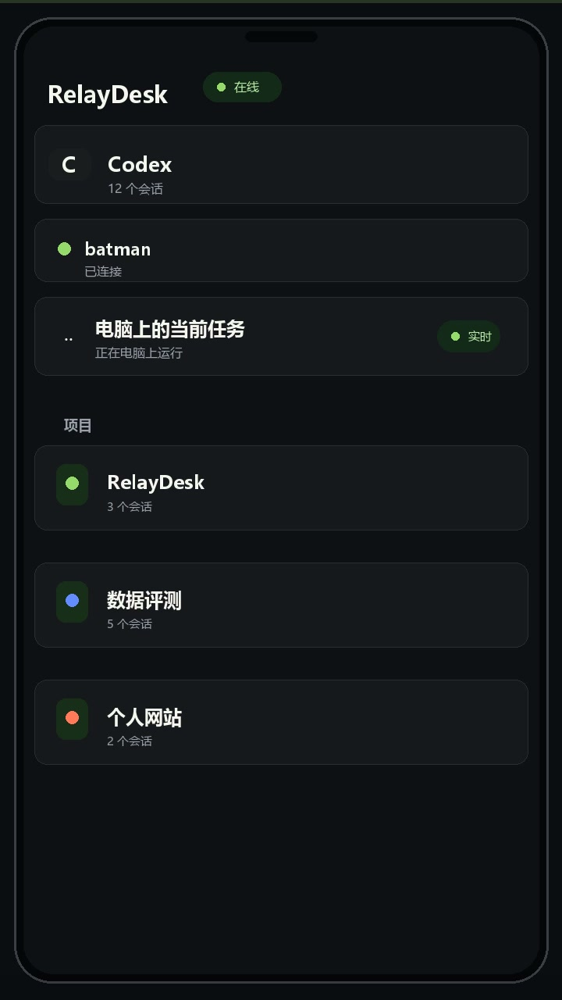
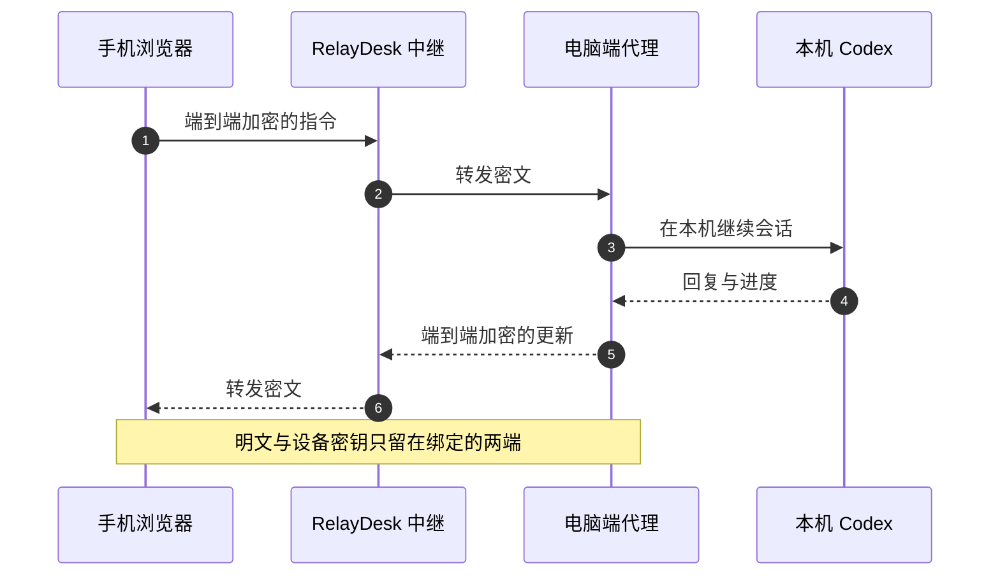

<p align="center">
  
</p>

<h1 align="center">RelayDesk</h1>

<p align="center">
  <strong>把电脑上的 Codex，带在身边。</strong>
  <br>
  <sub>离开电脑，也能从手机浏览器继续任务、查看会话与接收实时回复。</sub>
</p>

<p align="center">
  <a href="https://relay.xingshihao.site"></a>
  <a href="#-快速开始"></a>
  <a href="https://github.com/Neroxsh/RelayDesk/issues"></a>
</p>

<p align="center">
  <a href="https://github.com/Neroxsh/RelayDesk/actions/workflows/ci.yml"></a>
  
  
  <a href="./LICENSE"></a>
  <a href="https://github.com/Neroxsh/RelayDesk/stargazers"></a>
</p>

<p align="center">
  <code>无需手机 App</code>&nbsp;&nbsp;·&nbsp;&nbsp;<code>手机无需登录 ChatGPT</code>&nbsp;&nbsp;·&nbsp;&nbsp;<code>无需 VPN</code>&nbsp;&nbsp;·&nbsp;&nbsp;<code>端到端加密</code>
</p>

---

<p align="center">
  <a href="https://github.com/Neroxsh/RelayDesk/blob/main/docs/assets/relaydesk-promo.mp4">
    
  </a>
</p>

<p align="center">
 
  <br>
</p>

---

## 为什么是 RelayDesk

Codex 正在跑任务，你却要离开电脑；临时想到一个修改，电脑又不在手边。一个账号限额用完，电脑端切完，手机也要切换。中转无法使用手机端remote功能。
RelayDesk 把电脑上的本地会话接到手机浏览器——不是重新开一个聊天，也不要求手机登录对应的 ChatGPT 账号。

|  | RelayDesk |
| --- | --- |
| **继续原会话** | 按项目浏览电脑上的 Codex 会话，保留上下文继续工作 |
| **无需登录ChatGPT** | 无需登录，解决账号切换，以及使用中转时chatgpt手机端remote的的不便 |
| **实时跟进** | 回复、执行进度和任务状态自动同步到手机 |
| **浏览器即客户端** | 不安装 App，打开网页即可使用 |
| **一次绑定** | 电脑确认后持续可用，主动解除前无需反复认证 |
| **本地执行** | Codex 仍在你的电脑上运行，继续使用本机环境与文件 |
| **自动恢复** | 后台代理异常退出后自动拉起，不弹出终端窗口 |

## ✦ 主要能力

<table>
  <tr>
    <td width="50%"><strong>🗂 项目与会话</strong><br><sub>按工作区分组，不必在一长串历史记录里寻找任务。</sub></td>
    <td width="50%"><strong>⚡ 实时回复</strong><br><sub>持续同步输出，并用进行中状态提示当前任务尚未结束。</sub></td>
  </tr>
  <tr>
    <td><strong>🎛 Codex 控制</strong><br><sub>选择模型、思考强度、工作区权限与可用服务通道。</sub></td>
    <td><strong>📊 用量状态</strong><br><sub>读取 Codex 返回的套餐、额度窗口与使用概览。</sub></td>
  </tr>
  <tr>
    <td><strong>🖥 当前窗口</strong><br><sub>在 Windows 上向当前打开的 Codex 桌面会话发送指令。</sub></td>
    <td><strong>♾ 后台常驻</strong><br><sub>开机启动、单实例运行、异常自恢复，全程隐藏在后台。</sub></td>
  </tr>
</table>

<p align="center">
  
  <br>
  <sub>项目、会话与电脑上的当前任务，在一块手机屏幕里。</sub>
</p>

## 🔐 安全模型



- 电脑控制中心仅监听 `127.0.0.1`，不直接暴露到公网。
- 新手机必须输入连接码，并在电脑本机确认。
- 中继只负责转发密文，不保存连接密钥明文。
- 远程请求被限制为 RelayDesk 定义的会话操作，不提供任意 Shell 接口。
- 已绑定设备可随时在电脑控制中心解除。

更多说明见 [Security Policy](./SECURITY.md)。

## 🚀 快速开始

### 环境要求

- Windows 10 / 11 或 macOS
- Node.js `22.13.0` 或更高版本
- 已安装并登录 Codex CLI
- Windows 可选：Codex 桌面应用

### 方式一：从源码安装

```powershell
git clone https://github.com/Neroxsh/RelayDesk.git
cd RelayDesk
npm install
npm run setup
```

### 方式二：使用 Python 命令入口

```powershell
pip install git+https://github.com/Neroxsh/RelayDesk.git
relaydesk setup
```

安装完成后，电脑会自动打开控制中心：

```text
http://127.0.0.1:43127
```

接下来只需要三步：

1. 手机打开 [relay.xingshihao.site](https://relay.xingshihao.site)。
2. 输入电脑控制中心显示的 16 位连接码。
3. 回到电脑确认这台手机。

绑定完成。以后直接打开手机网页即可，不需要重新配对。

## ⟳ 更新

源码安装：

```powershell
git pull
npm install
npm run setup -- --yes
```

Python 命令入口：

```powershell
pip install --upgrade --force-reinstall git+https://github.com/Neroxsh/RelayDesk.git
relaydesk setup
```

更新不会主动清除已有绑定。

## 平台能力

| 能力 | Windows | macOS |
| --- | :---: | :---: |
| 浏览项目、历史会话与实时回复 | ✅ | ✅ |
| 后台启动 | Task Scheduler | LaunchAgent |
| 后台异常自动恢复 | ✅ | ✅ |
| 向当前 Codex 桌面窗口注入消息 | ✅ | — |

## 会话没有出现？

RelayDesk 会依次检查 `CODEX_HOME`、当前用户的 `.codex` 目录、XDG 配置目录和 Windows Codex 数据目录。

如果 Codex 使用了自定义位置，在电脑控制中心填写以下任意一种路径即可：

```text
C:\Users\你的名字\.codex
C:\自定义位置\.codex\sessions
```

<details>
  <summary><strong>手机显示“等待电脑上线”</strong></summary>
  <br>
  先打开电脑控制中心确认后台状态。Windows 安装器会创建单实例计划任务并自动恢复异常退出的代理；通常不需要重新配对。
</details>

<details>
  <summary><strong>更换电脑或解除绑定</strong></summary>
  <br>
  在原电脑控制中心解除对应设备，再用新电脑显示的连接码重新绑定。不要把连接码或 <code>.relaydesk/config.json</code> 发给其他人。
</details>

## 🧭 Roadmap

- [x] Codex 项目与历史会话
- [x] 实时输出与进行中状态
- [x] 永久绑定与端到端加密
- [x] Windows 无窗口自恢复代理
- [ ] Claude Code 独立会话入口
- [ ] 可选的自托管中继部署模板
- [ ] PWA 通知与主屏幕体验

## 开发

```powershell
npm install
npm run dev
npm run lint
npm test
```

贡献前请阅读 [CONTRIBUTING.md](./CONTRIBUTING.md)。安全问题请通过 GitHub 私密安全报告提交，不要在公开 Issue 中粘贴设备密钥、配对码或会话内容。

## Community

<p align="center">
  <a href="https://github.com/Neroxsh/RelayDesk/issues">Report a bug</a>
  ·
  <a href="https://github.com/Neroxsh/RelayDesk/issues">Request a feature</a>
  ·
  <a href="./CONTRIBUTING.md">Contribute</a>
  ·
  <a href="./SECURITY.md">Security</a>
</p>

<p align="center">
  <strong>如果 RelayDesk 让你少等了一次电脑，欢迎点一个 Star。</strong>
  <br><br>
  <a href="https://github.com/Neroxsh/RelayDesk/stargazers"></a>
</p>

<p align="center">
  <sub>MIT License · Built for work that should not stop at your desk.</sub>
</p>

